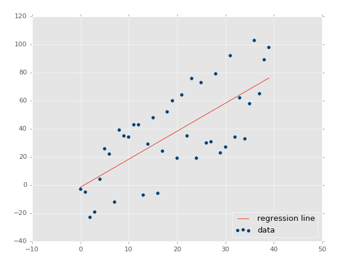

# Simple linear regression

Simple linear regression is a type of linear regression that involves only one independent variable and one dependent variable. In other words, it models the relationship between two variables by fitting a linear equation to the data.

The goal of simple linear regression is to find the best-fit line that describes the linear relationship between the independent and dependent variables. This line is characterized by its slope (m) and intercept (b), which are estimated during the training process.

`y = mx + b`

Linear regression algorithms will seek to find optimal values for m (the slope of the line)and b(The intercept, also known as the bias). This line equation should then allow us to compute a value for y, our dependent variable, so long as we have some input x.

During training, the algorithm tries to minimize the sum of squared errors between the predicted values of the dependent variable and the actual values in the training data. Once the line of best fit has been found, it can be used to predict the value of the dependent variable for new values of the independent variable that were not present in the training data.

Simple linear regression can be useful for a variety of applications, such as predicting the price of a house based on its size or predicting the amount of time it will take to complete a task based on the number of resources allocated to it.

It's important to note that simple linear regression assumes a linear relationship between the independent and dependent variables. If this assumption is not met, other types of regression, such as polynomial regression or logistic regression, may be more appropriate.

A few things to note when using linear regression:
- This is best for predicting continuous variables: Something like price, duration, etc. We will unveil other algorithms later that deal with discrete variables.
- As you can probably tell from the graph above, linear regression models can be heavily biased by a few outliers in the data. Your data cleaning will be critical to get the most out of linear regression.
