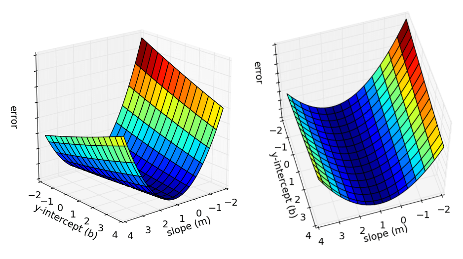
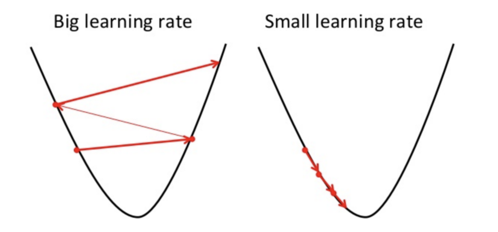

We will typically leverage multiple independent variables to make our predictions, but the logic
remains. instead of the simple line equation above, if we have n independent variables, we will end up with an equation that looks like:

`y = b + m 1 x 1 + m 2 x 2 + m 3 x 3 + .... + m n x n`

Mathematically this is sound: With only one independent variable, this is the equation of a line, with 2, this becomes the equation of a 2d plane in 3 dimensions, etc.

A linear regression with multiple variables is called a multivariate linear regression. One
particularly interesting result in these scenarios is studying the various coefficients. Effectively in an optimized model, what coefficient `m1` tells us is that if all other independent variables remain constant, increasing `x 1` by 1 will increase `y` by `m 1`. This can help you get a sense of how much each independent variable "contributes" to the value of the dependent variable.

## Where is the machine learning in this?

How do we come up with an optimal line equation for our model? what is the best value
for m and b? A first step to optimizing m and b is to create an error function (often referred to as cost function as well) to assess how good our line `y = mx + b` is.

If you look at the graph above, our regression line does not pass through most of the points,
suggesting it's fairly error-prone. To compute the error function we can perform the following steps on each data point in our data set
1. Compute the difference between your data for the dependent variable, and the prediction from
the regression line
1. Square that value, we want all the differences to be positive
2. Add up all the values you've obtained
3. Divide by the number of data points.

In summary, your error function is the average value of `(y i - (mx i +b))^2` for all your data points. We want to tweak the values of `m` and `b` in order to minimize this function.

This is where the gradient descent algorithm comes into play. Imagine plotting the possible values
of m and b against the error function's value. You'd end up with a shape like this.

In the example above, the shape takes the form of a valley of sorts, we basically want to find the
point at the bottom of that valley.
Imagine if you were blindfolded on a hill, and asked to come down of it. How would you approach
that challenge? Well, you could feel the ground for the slope of the hill, and get a sense for where it's sloping downwards, then follow that route.

This is effectively what gradient descent algorithms do. They pick an initial value for m and b, then compute the error. From then on, they compute the slope (or gradient) at that point, then move towards new values for m and b that are "downhill" from where they started.

How much m and b change from an iteration to the next is based on the learning rate. This is a very important parameter, which is worth considering carefully:
- A low learning rate will lead to a very slow model to train. You will be waiting for a long time for the optimal regression line.

- A high learning rate risks missing the optimal point altogether, as exemplified in the picture
below.
- Gradient descent is a crucial algorithm to be familiar with. Make sure to take time on it today.

Common variants of gradient descent:
- Batch gradient descent
- Stochastic gradient descent
- Mini-batch gradient descent
